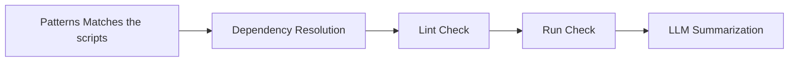

# RepCheck (Initial Draft)


Just a simple checker for the time being which checks whether all the script runs or not.
We are using the `subprocess` library of Python which helps us to spawn processes with a ton of arguments — a fancier way of saying that we can use a program to run programs.

We are using **Ollama** with IBM's instruction-following model `granite3.3:2b` for the code error summarization.

---

## Current State

In the `test_scripts` directory we have some scripts with different folders to emulate different scripts, some of them bound to fail and some not.

To make sure this runs:

```bash
pip install ollama
ollama run granite3.3:2b
ollama serve   # Very important because this is where API calls are going to be made.
```

```bash
python3 -m repcheck.main --dir /path/to/directory
```

If you want to get a sense of how the package is going to be developed, you can run the following commands:

```bash
alias repcheck="python /path/to/directory/repcheck_cli.py"
repcheck check --dir   # for usage
```

> The `--dir` command line argument is used to specify the directory of the scripts.

---

## Future Direction

I have implemented the dependency resolution. It is a graph-based one which tracks the number of sources in the files and tries to resolve the dependencies.

---

## Goals

The current bottleneck I am facing is to identify which section of the code belongs to which output.
This is something that needs to be discussed with Moritz.

---

## Flow Diagram



---

## CLI Usage

```
Usage: repcheck_cli.py [OPTIONS] COMMAND [ARGS]...

  R Script Checker

Options:
  --install-completion     Install completion for the current shell.
  --show-completion        Show completion for the current shell, to copy it or customize the installation.
  --help                   Show this message and exit.

Commands:
  check   Check R scripts and show comprehensive results.
  order   Show script execution order only.
```

---

