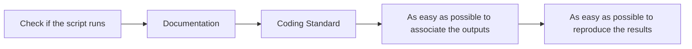

***

### Simple Script Checker (Initial Draft)

Just a simple checker for the time being which checks whether all the script runs or not. We are using the `subprocess` library of python which helps us to spawn processes with a ton of arguments, Haha fancier way of saying that we can use a program to run programs. 

***

## Current State
So the current state is in the `test_scripts` directory we have some scripts, some of them bound to fail and some not. 

```bash
python3 rcheck_cli.py -d test_scripts/
```

To run all the rscripts and check which are running which are not. It essentially run all the scripts one after another (**Note : We also need to focus on the sequential nature of running the scripts**) and return the `exit_code` which if non zero means that something is wrong and also outputs the error. 

> Here the `-d` command line argument is used to specify the directory of the scripts. 

***

## Future Direction
In the future this error can be fed into a simple LLM, i am thinking ollama to help me do this and we can generate an report using the same. 

***

## Goals
I have identified that the most important goals of the CLI tool will be:  

- to check the **associativity of the code**  
- **ease of reproducibility** of the code  

But the bottleneck currently facing is about the executing and identification of code snippets to run to check reproducibility $\to$ this is also a question of how reproducible the script is. 

***

## Flow Diagram



----

## Updates : 
1. Linting 
2. Error summarization
3. Dependency Resolution.