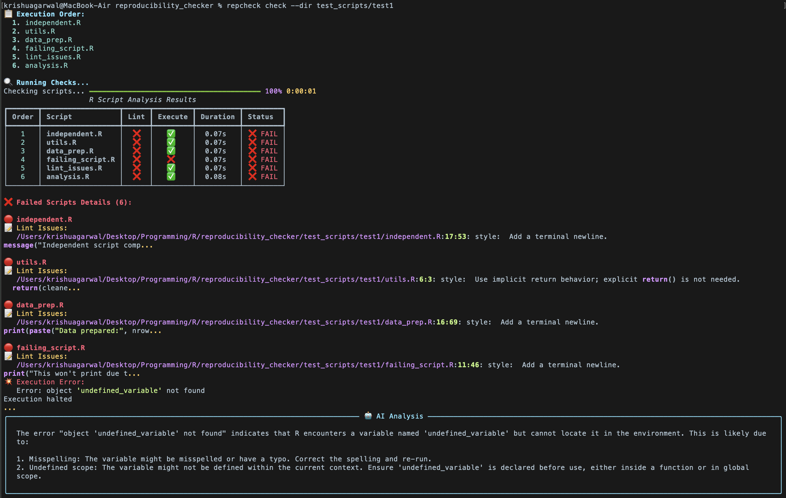
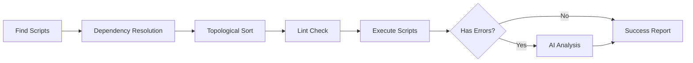

# RepCheck 



Just a simple checker for the time being which checks whether all the script runs or not.

We are using the `subprocess` library of Python which helps us to spawn processes with a ton of arguments — a fancier way of saying that we can use a program to run programs.

We are using **Ollama** with IBM's instruction-following model `granite3.3:2b` for the code error summarization.

---

## Flow Diagram



---

## Current State

In the `test_scripts` directory we have some scripts with different folders to emulate different scripts, some of them bound to fail and some not with the support for different languages. 

>[!IMPORTANT]
> We need to test it *extensively* on different code bases for following the basic guidelines from different research publications like > **ACL**. 

To make sure this runs:

```bash
pip install ollama
ollama run granite3.3:2b
ollama serve   # Very important because this is where API calls are going to be made.
```

If you want to get a sense of how the package is going to be developed, you can run the following commands:

```bash
alias repcheck="/path/to/reproducibility_checker/repcheck_cli.py"
repcheck check --dir ~/my-research-project # Default checking with R
repcheck order --dir ~/scripts --lang python
```

> The `--dir` command line argument is used to specify the directory of the scripts.
> The `--lang` command line argument is used to specify the programming language of the scripts.

## CLI Usage

```bash
./repcheck_cli.py check # Check R scripts in current directory
./repcheck_cli.py check --dir test_scripts/r/test1 # Check R scripts in specific directory
./repcheck_cli.py check --dir test_scripts/python/test1 --lang python # Check Python scripts
./repcheck_cli.py order --dir test_scripts/python/test1 --lang python # Show execution order without running
./repcheck_cli.py check --dir my-project --no-llm # Skip AI analysis (faster)
./repcheck_cli.py check --dir . --pattern "scripts/**/*.R" --lang r # Custom file patterns
./repcheck_cli.py check --dir . --exclude "test_*.py" --lang python # Exclude files
```

---

## Future Direction

I have implemented the dependency resolution. It is a graph-based one which tracks the number of sources in the files and tries to resolve the dependencies.

---

## Goals

The current bottleneck I am facing is to identify which section of the code belongs to which output.
This is something that needs to be discussed with Moritz.

---

